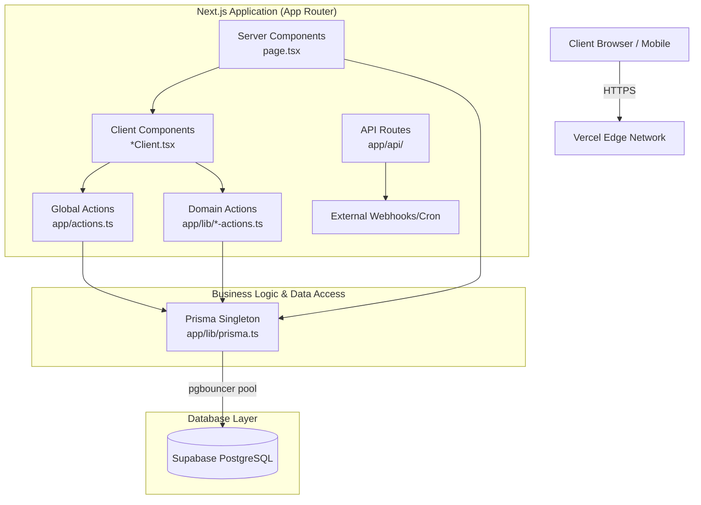

# Architecture Overview

This document outlines the high-level architecture of the EstatePulse. The application is designed as a **Full-Stack Monolith** utilizing Next.js 16 (App Router). This structure allows us to maintain strict end-to-end type safety, colocate business logic with UI components, and streamline deployments.

## System Architecture Diagram

