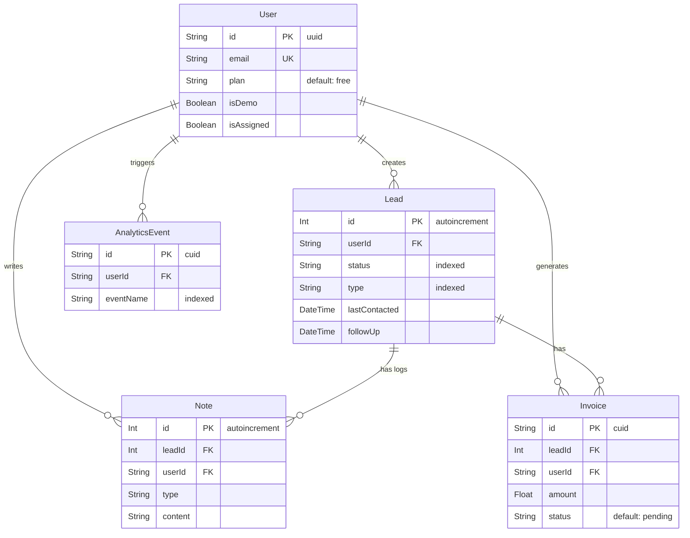

# Database & Data Model

The Real Estate CRM relies on a strict, relational database architecture. We use **PostgreSQL** (hosted via Supabase) to ensure data integrity, paired with **Prisma ORM** as our strongly typed database client and Single Source of Truth (SSOT).

---

## 1. Infrastructure & Connection Management

Serverless environments (like Vercel) can easily overwhelm a traditional relational database by opening hundreds of concurrent connections during traffic spikes or hot-reloading.

To mitigate this, our database architecture utilizes a dual-connection strategy:

- **Connection Pooling (`DATABASE_URL`):** Utilizes Supabase's built-in `pgbouncer` (Transaction Mode). This pools connections, allowing Next.js Server Actions and edge functions to scale infinitely without crashing the database.
- **Direct Connection (`DIRECT_URL`):** A direct, unpooled connection used exclusively by Prisma CLI for running migrations (`prisma db push`) and complex background tasks.

### Environment Isolation

We maintain strict physical separation between development and production data:

- **Production Database:** Linked to the `main` branch.
- **Preview/Dev Database:** Linked to the `dev` branch. Managed via Vercel's Environment Variable scopes to ensure preview deployments never mutate live production data.

---

## 2. Core Schema & Entity Relationships

Our schema is strictly defined in `prisma/schema.prisma`. Below are the core entities and their relationships.

### `AllowedUser` (Access Control)

- **Purpose:** Acts as a whitelist for the Closed Pilot phase.
- **Logic:** During registration or Google OAuth sign-in, the system checks if the user's email exists in this table. If not, access is denied.

### `User` (NextAuth)

- **Purpose:** Represents an authenticated real estate agent.
- **Relationships:** One-to-Many with `Lead`.
- **Note:** Custom NextAuth interceptors map incoming Google OAuth string IDs to PostgreSQL UUIDs before upserting into this table.

### `Lead` (The Core Entity)

- **Purpose:** Represents a client (Buyer, Seller, Tenant, or Landlord).
- **Key Fields:** `status`, `type`, `budget`, `demand`, `location`, `propertyType`.
- **Relationships:**
  - **One-to-Many with `Note` (Logs):** An aliased relationship (`logs`) representing the chronological activity timeline (Calls, WhatsApp messages, Meetings).
  - **One-to-Many with `Invoice`:** Tracks multiple commission payments or financial records associated with a single lead.

### `Note` (Dual-System Logging)

- **Purpose:** Handles all text-based lead history.
- **Architecture:** We use a single `Note` table to handle two distinct UI concepts:
  1.  _Sticky Notes:_ General, static remarks about the lead.
  2.  _Activity Logs:_ Chronological, type-specific events (e.g., "Called at 2:00 PM").

### `Invoice` (Financials)

- **Purpose:** Tracks commission details and payment statuses.
- **Fields:** `amount`, `status` (`'paid' | 'pending'`), `dueDate`.
- **Usage:** Queried by the `InvoiceModal` to generate client-side PDFs via `@react-pdf/renderer`.

---

## 3. Query Optimization

Because Prisma is "lazy" by default, it does not fetch relational data unless explicitly requested. To optimize dashboard load times and prevent N+1 query problems, we utilize Prisma's `include` and `select` operators within our Server Actions:

```typescript
// Example: Deep relational fetch for the Lead Profile
const leadData = await prisma.lead.findUnique({
  where: { id: leadId },
  include: {
    logs: {
      orderBy: { createdAt: "desc" },
    },
    invoices: true,
  },
});
```

## Entity-Relationship (ER) Diagram

The following diagram outlines the core table relationships based on our `schema.prisma`.


